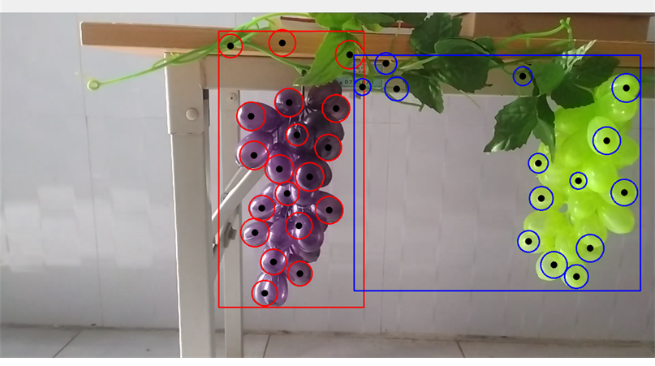
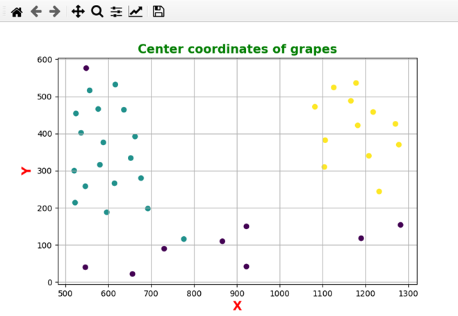
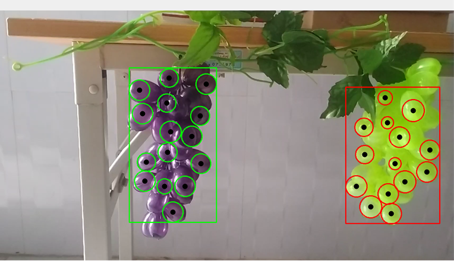

## **This implementation for grape detection using Image Processing + Clustering**

## ***Note***: *This method is just for testing and comparison*

## ***Ideal***: 
- Each grape on the cluster is round in shape, so we use a traditional image processing algorithm called: Hough Circle to detect these round grape. 
- After detected, each grape has a center, so we see these center as a data point in 2D space. After that, we use Machine Learning clustering algorithms to split and cluster them.
- We use 2 clustering algorithms for this projects: KMeans and DBSCAN. DBSCAN gives results that seem good and superior to Kmeans

## ***Demo and results***

1. Hough Circle + KMeans
   
   Grape centers clustering after applying Kmeans
   

   Clustering results
   

2. Hough Circle + DBSCAN
   
   Grape centers clustering after applying DBSCAN
   

   Clustering results
   
   
Demo video: https://www.youtube.com/watch?v=TE46iTGDzWM
